# Fluxograma de Arquitetura e Comunicação - MasterIA

> [!IMPORTANT]
> **Status:** Diagrama de Engenharia de Sistemas
> **Escopo:** Mapeamento visual das conexões entre Front-end, Back-end, Filas, Bancos de Dados e APIs Externas.
> **Destinatário:** Analista de Sistemas / Arquitetura de Software / Engenheiros DevOps.

Este diagrama ilustra a macro-arquitetura do MasterIA e o fluxo de vida dos dados, desde a interação do cliente no WhatsApp até o retorno da Inteligência Artificial.

## Diagrama da Arquitetura (Mermaid)

Para visualizar corretamente, abra este arquivo em um visualizador Markdown que suporte `mermaid` ou cole o código abaixo no [Mermaid Live Editor](https://mermaid.live).

```mermaid
graph TD
    %% Define as cores e estilos globais
    classDef frontend fill:#3b82f6,stroke:#1e3a8a,stroke-width:2px,color:#fff
    classDef backend fill:#10b981,stroke:#047857,stroke-width:2px,color:#fff
    classDef db fill:#f59e0b,stroke:#b45309,stroke-width:2px,color:#fff
    classDef queue fill:#ef4444,stroke:#b91c1c,stroke-width:2px,color:#fff
    classDef external fill:#8b5cf6,stroke:#4c1d95,stroke-width:2px,color:#fff

    %% NÓS EXTERNOS
    subgraph "Camada Externa (Clientes & APIs)"
        Client["📱 Cliente no WhatsApp"]:::external
        MetaAds["📈 Meta Ads API (Ad-Intelligence)"]:::external
        OpenAI["🧠 OpenAI / Gemini (LLMs)"]:::external
        ElevenLabs["🎙️ ElevenLabs (Voice AI)"]:::external
    end

    %% FRONTEND
    subgraph "Camada de Interface (Frontend Next.js)"
        Dashboard["💻 Dashboard Admin (App Router)"]:::frontend
        Inbox["💬 Inbox / Atendimentos (SPA)"]:::frontend
        Kanban["📋 CRM / Kanban (Drag & Drop)"]:::frontend
        FlowBuilder["⚙️ Automação (React Flow)"]:::frontend
    end

    %% BACKEND & SERVIDOR
    subgraph "Camada de Kernel e API (Backend Node.js)"
        Server["🖥️ Custom Server (server.ts)"]:::backend
        WebSockets["🔌 Socket.io (Real-Time)"]:::backend
        NextAPI["🌐 Next.js API Routes / Server Actions"]:::backend
        
        %% MÓDULOS DE PROCESSAMENTO
        Auth["🔒 Auth & Tenant Guard"]:::backend
        AutoEngine["⚙️ Automation Engine (PII Masking & Pacing)"]:::backend
        FlowEngine["🔀 Flow Engine (BFS Traversal)"]:::backend
    end

    %% WORKERS E FILAS
    subgraph "Camada Assíncrona (Event-Driven)"
        BullMQ["📦 BullMQ (Redis Message Broker)"]:::queue
        WorkerTrigger["🤖 campaign-trigger.worker"]:::queue
        WorkerTimeout["⏱️ automation-timeout.worker"]:::queue
    end

    %% BANCO DE DADOS
    subgraph "Camada de Persistência (PostgreSQL + Drizzle)"
        DB_Relacional[("🗄️ MasterIA DB\n(OLTP Relacional - Porta 5433)")]:::db
        DB_Vector[("🧠 MasterIA Vector DB\n(RAG / pgvector - Porta 5434)")]:::db
    end

    %% ---------------------------
    %% CONEXÕES E FLUXOS
    %% ---------------------------

    %% 1. Inbound: Do Cliente até o Motor
    Client -- "Envia Mensagem (Webhook)" --> NextAPI
    NextAPI -- "Salva a Mensagem e verifica o Tenant" --> DB_Relacional
    NextAPI -- "Gatilho de nova mensagem" --> AutoEngine

    %% 2. Processamento IA e Regras
    AutoEngine -- "Interpreta regras do Funil" --> Kanban
    AutoEngine -- "Busca conhecimento (Embeddings)" --> DB_Vector
    AutoEngine -- "Envia Prompt Limpo (Sem PII)" --> OpenAI
    OpenAI -- "Devolve Resposta (Texto)" --> AutoEngine
    AutoEngine -- "Solicita Áudio (opcional)" --> ElevenLabs

    %% 3. Outbound e Tempo Real
    AutoEngine -- "Agenda Disparo / Evita duplo envio" --> BullMQ
    AutoEngine -- "Dispara Atualização na Tela" --> WebSockets
    WebSockets -- "Ouve Evento 'new_message'" --> Inbox
    WebSockets -- "Atualiza Card" --> Kanban

    %% 4. Disparos em Massa (Campanhas)
    Dashboard -- "Agenda Campanha" --> NextAPI
    NextAPI -- "Joga Chunks na Fila" --> BullMQ
    BullMQ -- "Processa Lote respeitando Rate Limit" --> WorkerTrigger
    WorkerTrigger -- "Envia Mensagens em Massa" --> Client

    %% 5. Automações Condicionais
    FlowBuilder -- "Desenha nós em JSON" --> NextAPI
    NextAPI -- "Salva Grafo" --> DB_Relacional
    DB_Relacional -- "Carrega JSON para Memória" --> FlowEngine
    FlowEngine -- "Calcula Delays/Timeouts" --> WorkerTimeout
    WorkerTimeout -- "Executa ação tardia" --> NextAPI

    %% 6. Ad-Intelligence (Integração)
    Server -- "CRON Job de Sincronização" --> MetaAds
    MetaAds -- "Retorna Métricas de CPL/ROAS" --> DB_Relacional
    Dashboard -- "Visualiza Gráficos (Dashboard Insights)" --> NextAPI
    NextAPI -- "Pede para IA sugerir Copy" --> OpenAI
```

### Entendendo o Fluxo pelas Cores:
- 🟣 **Roxo (Externo):** Canais onde os dados nascem (Clientes no Zap) ou fornecedores vitais de I.A (OpenAI) e Tráfego (Meta).
- 🔵 **Azul (Front-end):** A interface do MasterIA, altamente responsiva. O *Inbox* depende estritamente do verde (*WebSockets*) para viver em tempo real.
- 🟢 **Verde (Back-end / Cérebro):** Onde a mágica ocorre. O `server.ts` injeta o Socket.io e intercepta a API do Next.js. O *Automation Engine* orquestra a comunicação, limpa dados sensíveis (PII) e comanda o envio.
- 🔴 **Vermelho (Background Workers):** A barreira contra quedas. O Redis segurando milhares de requisições via BullMQ para disparos de marketing em massa sem derrubar o container.
- 🟠 **Laranja (Bancos de Dados):** O *Drizzle ORM* conectando-se a dois corações em paralelo. O DB Relacional para armazenar Leads/Mensagens e o Vector DB para buscas matemáticas de Inteligência Artificial (RAG).
